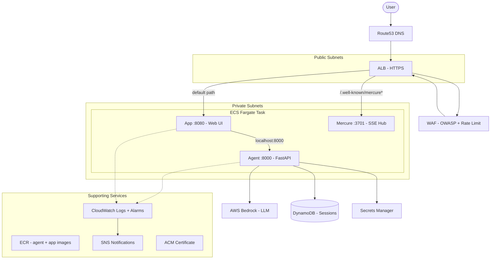
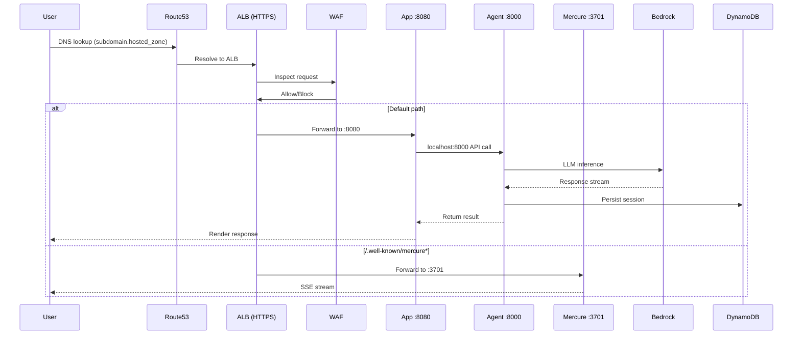
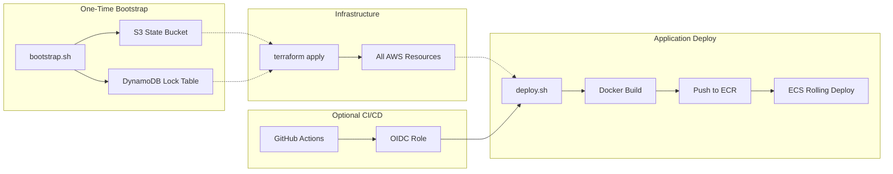
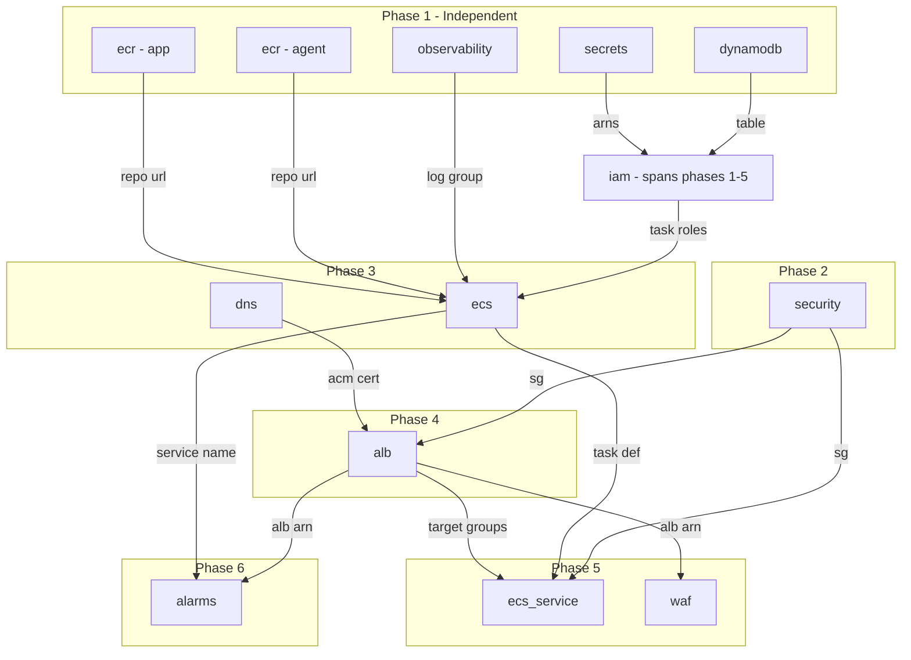

# Architecture

Reference for AI coding agents. Read this before modifying any module.

## System Overview

The three containers share a network namespace so App calls Agent over localhost -- no service discovery needed. ALB sits in public subnets while ECS tasks run in private subnets, keeping workloads off the public internet. WAF attaches to the ALB to filter traffic before it reaches any container.

## Request Flow

HTTP hits the ALB (which redirects to HTTPS), WAF evaluates OWASP rules and rate limits, then path routing splits traffic. App handles the UI and proxies to Agent over localhost; Mercure handles SSE streaming on its dedicated path. Agent reads its API key from Secrets Manager and writes sessions to DynamoDB.

## Deployment Flow

Bootstrap runs once to create the Terraform state backend. `terraform apply` provisions all infrastructure. Application deploys are decoupled -- `deploy.sh` builds images, pushes to ECR, and triggers a rolling ECS deployment without re-running Terraform.

## Module Dependency Graph

Phase 1 modules have no dependencies and deploy in parallel. Security must exist before ALB and ECS service because both need security group references. ALB cannot be created until DNS provides the ACM certificate. IAM spans multiple phases: task roles are needed at Phase 3 for ECS task definitions, but the OIDC policy references outputs from Phase 3-5 resources.
